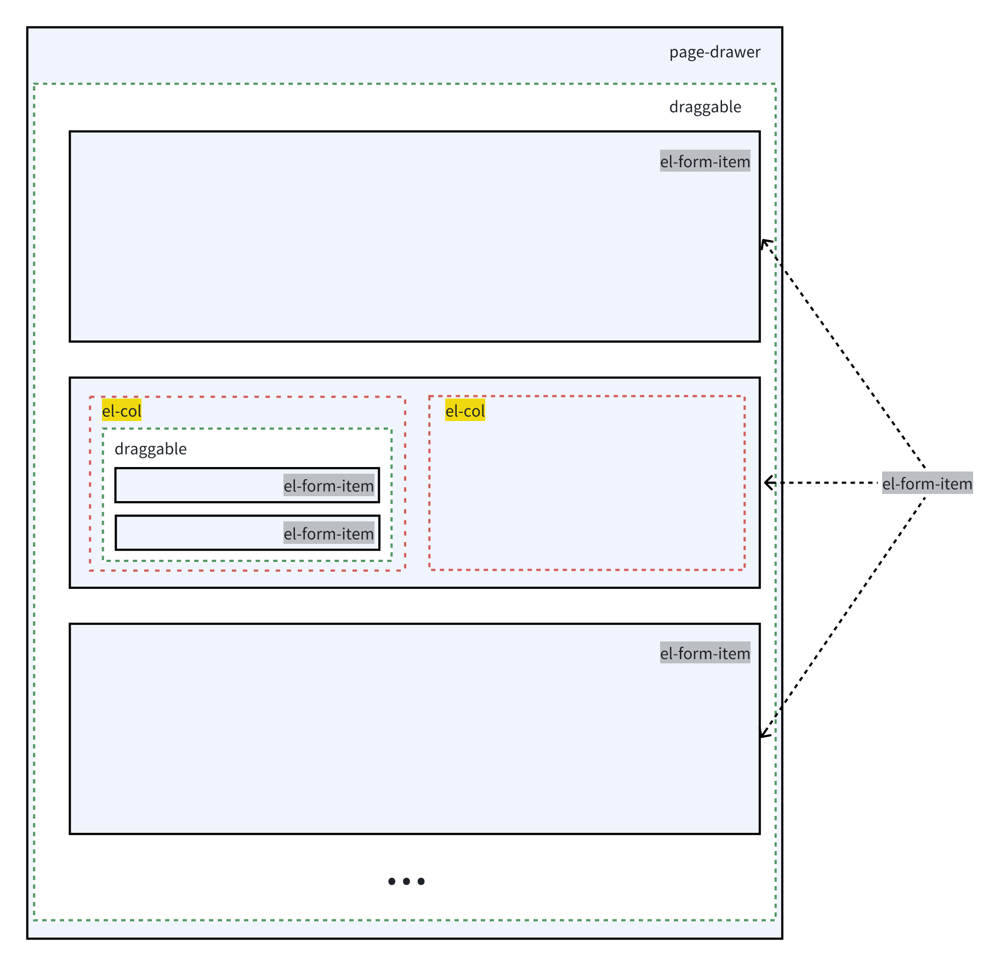

# VFG

<p>
     <a href="https://github.com/zhonghuitech/vfg/actions/workflows/docs.yml"></a>
     <a href="https://www.npmjs.com/package/vfg"></a>
     <a href="https://www.npmjs.com/package/vfg"></a>
     <a href="https://www.npmjs.com/package/vfg"></a> 
</p>

VFG: Vue3 Form&Page Generator (based on Element-Plus).

## Usage

1. Install `vfg`

```sh
pnpm install vfg
```

2. Config `main.js`

```js
import { createApp } from 'vue'
import App from './App.vue'
import ElementPlus from 'element-plus'; // 三方依赖
import 'element-plus/theme-chalk/index.css';
import * as ElIcon from '@element-plus/icons-vue'
import zhCn from 'element-plus/es/locale/lang/zh-cn';

const app = createApp(App);
app.use(ElementPlus, {
    locale: zhCn,
});
Object.keys(ElIcon).forEach((key) => {
    app.component(key, ElIcon[key])
})

// vfg settings.
import { setupVFG } from "vfg"
import 'vfg/dist/assets/css/style.css';
import 'virtual:svg-icons-register'
setupVFG(app)

app.mount('#app')

```

3. Page use vfg
```vue
<template>
  <div>
    <FormGenerator device="pc" />
  </div>
</template>

<script lang="ts" setup>
</script>
``` 

4. Full example
[vfg-usage-demo](https://github.com/zhonghuitech/vfg-usage-demo)

## Project Setup

```sh
pnpm install
```

### Compile and Hot-Reload for playground

```sh
pnpm pg
```

### Type-Check, Compile and Minify for Production

```sh
pnpm build
```

### Run Unit Tests with [Vitest](https://vitest.dev/)

```sh
pnpm test:unit
```

## Tree Render Framework

